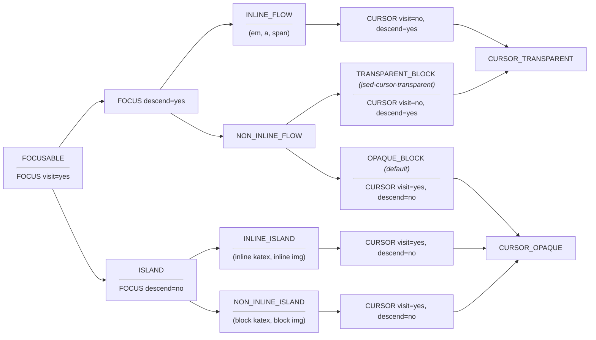

# Jsed Vocabulary

Shared terms for communicating about jsed (an evolving, living set — not a static glossary).

Terms are written in UPPER_SNAKE_CASE so they stand out in prose and conversation.
When using pluralize a term FOO_BAR, use "FOO_BAR's" not "FOO_BARs" because human editors using vim `*` search will not find "FOO_BARs".

Terms like "next" / "after" or "previous" / "before" refer to logical order in the DOM — the next or previous node in the data structure. They make no assumptions about visual direction. In an RTL context (e.g. Arabic), "next" is visually leftward; in LTR (e.g. English), rightward.

## Primitives

The taxonomy is built from a small set of independent predicates. All other labels (LINE, OPAQUE_BLOCK, etc.) are derived from combinations of these. Source of truth: `taxonomy.ts`.

- **`isFocusable`** — can the user navigate to this element?
- **`isIsland`** — externally managed content (katex, ``, form controls)?
- **`isInlineFlow`** — pure display predicate: CSS `display: inline` or `display: inline flow`, and not floated. Excludes `inline-block`, `inline-flex`, `inline-grid`. No focusable/island/class checks.
- **`isImplicitLine`** — synthetic wrapper (IMPLICIT_LINE) created by tokenization?
- **`isToken`** — a jsed token span?

## Elements

- **FOCUSABLE** (focusable element) — an element the user can navigate to and FOCUS on. Cannot be a TOKEN or an IGNORABLE.
  - Source of truth: `isFocusable` in `taxonomy.ts`.
- **IGNORABLE** - An element that cannot be FOCUS'ed and is effectively invisible to user navigation and other jsed operations (although it may be very much visible to the user).
  - Example: temporary markers or nodes generated in the DOM to assist the user or the editing process.
  - Source of truth: `isIgnorable` in `taxonomy.ts`.

We define the idea of a FOCUS on a FOCUSABLE:

- **FOCUS** — the current FOCUSABLE the user has selected (clicked, touched, or navigated to). This is not a native browser focus which would conflict with Oneput's input element.
  - Source of truth: search docstrings for FOCUS.

We can break FOCUSABLE's down into different categories...

FOCUS descend=yes:

- **INLINE_FLOW** — a FOCUSABLE with inline-flow display (`isInlineFlow`) that is not an ISLAND or IMPLICIT_LINE. FOCUS can visit and descend. Often intended to mark up one or more TOKEN's — e.g. ``, `<em>`, `<a>`. Excludes inline-block, inline-flex, and elements taken out of normal flow (float, etc.). Derived: `isFocusable && isInlineFlow && !isIsland && !isImplicitLine`.
  - Source of truth: derived from primitives in `taxonomy.ts`.
- **NON_INLINE_FLOW** — a FOCUSABLE that is not INLINE_FLOW: `!isInlineFlow || isIsland || isImplicitLine`. Includes blocks, inline-blocks, ISLANDs, etc. FOCUS can visit and descend.

FOCUS descend=no:

- **ISLAND** - FOCUS can visit but not descend into or edit directly (via tokenization) because of pre-existing rules we define that disallow it. Normal nodes can be designated islands according to pre-existing rules. The CURSOR visits ISLAND's as opaque LINE_SIBLING's (visit=yes, descend=no) — it lands on the element itself but does not enter it. Editing operations (replace, delete, etc.) are no-ops when the CURSOR is on an ISLAND.
  - Example: a katex-rendered node. Rather than recurse the katex rendered node, we would load a textarea with the latex content and get katex to update the katex-rendered node for us.
  - Example: Some leaf nodes that have a special purpose eg `` tags etc may be treated as ISLAND's, others may end up being treated by default as either INLINE_FLOW or TRANSPARENT_BLOCK
  - Example: Also elements that are already natively focusable, e.g. form controls.
  - Source of truth: `isIsland` in `taxonomy.ts`.

If necessary, we can break ISLAND's down into:

- **INLINE_ISLAND** - ISLAND with inline-flow display (`isInlineFlow`)
- **NON_INLINE_ISLAND** - ISLAND without inline-flow display

Now that we've marked out INLINE_FLOW's and ISLAND's we are left with NON_INLINE_FLOW's which from the point of view of the CURSOR we call LINE's...

We introduce the idea of a CURSOR (defined below), allowing us to characterise FOCUSABLE elements by both their FOCUS and CURSOR behaviours where behaviours are VISIT and DESCEND.

- **LINE** — a FOCUSABLE that is not a TOKEN, INLINE_FLOW, or ISLAND. Derived: `isFocusable && !isToken && !isIsland && (!isInlineFlow || isImplicitLine)`. IMPLICIT_LINE's have inline display but are semantically LINE's (they're synthetic wrappers). TRANSPARENT_BLOCK's are LINE's.
  - Example: a `
`, `
`, inline-block ``, etc.
  - Source of truth: `isLine` in `taxonomy.ts`.
- **LINE_MEMBER** - FOCUSABLE's belong to the same LINE and are called LINE_MEMBER's if the first LINE ancestor in their ancestor chain is the same LINE.
  - Example: a TOKEN that either has a LINE as their parent or an INLINE_FLOW as parent that belongs to a LINE (etc).
- **NESTED_LINE** - a LINE that has another LINE as an ancestor. This includes both OPAQUE_BLOCK (default) and TRANSPARENT_BLOCK elements. In OPAQUE_BLOCK we deny the CURSOR the ability to descend when moving next, but we could move the FOCUS into that element and treat it as the new LINE. For TRANSPARENT_BLOCK (marked with `jsed-cursor-transparent`), the cursor will descend, effectively treating it like an INLINE_FLOW, but we can also FOCUS on it and treat as LINE in its own right.
- **LINE_SIBLING** — by sibling we mean something the CURSOR can VISIT within a LINE; which equates to the following:
  - it must belong to the LINE
  - it can be a TOKEN
  - it can be CURSOR_OPAQUE — CURSOR visits (does not descend)
  - it is not CURSOR_TRANSPARENT or INLINE_FLOW - CURSOR does not visit (but will descend)
  - anything visited by CURSOR in a CURSOR_TRANSPARENT or INLINE_FLOW where either belongs to the LINE;
    - Example: the TOKEN's in an em-tag within a p-tag are LINE_SIBLING's for the p-tag.
  - Source of truth: `isLineSibling` in `taxonomy.ts`.
- **LINE_SEGMENT** — a set of contiguous TOKEN's in a LINE. Non-LINE_SIBLING LINE_MEMBER's act as separators between LINE_SEGMENT's.
  - Example: `
...<em>...</em>...
` has 3 segments. The middle one represents the `<em>`'s text; the outer two are parts of the `
`.
- **CURSOR** - the current LINE_SIBLING the user has selected when editing the text of a document. This is distinct from FOCUS which is the current FOCUSABLE the user has selected. Usually the current FOCUSABLE becomes the current LINE within which the user edits the LINE_SIBLING's (text content).
  - Source of truth: search docstrings for CURSOR
- **CURSOR_LINE** - the CURSOR tracks the LINE it is on; this allows it to traverse arbitrarily nested TRANSPARENT_BLOCK elements within this line and not confuse them as the current LINE.
- **SIBLING**, **SIB**,— usually means a FOCUSABLE DOM sibling (ie nextSibling, nextElementSibling). Never means a TOKEN. Traversing SIBLING's almost always entails at a minimum skipping past IGNORABLE's.
  - Example: SIB_HIGHLIGHT - a visual highlight of FOCUSABLE SIBLING's

Non-TOKEN FOCUSABLE's group into two CURSOR behaviours:

- **CURSOR_OPAQUE** (CURSOR: visit=yes, descend=no) — the CURSOR lands on the element itself as an opaque LINE_SIBLING.
  - **ISLAND** — externally managed content (katex, ``)
  - **OPAQUE_BLOCK** — the default for any LINE (non-INLINE_FLOW, non-ISLAND FOCUSABLE): block, inline-block, etc. FOCUS can descend into it, but the CURSOR treats it as opaque. To make a block transparent, mark it with `jsed-cursor-transparent` class.
- **CURSOR_TRANSPARENT** (CURSOR: visit=no, descend=yes) — the CURSOR passes through to visit TOKEN children.
  - **INLINE_FLOW** — inline-level markup (`<em>`, `<a>`)
  - **TRANSPARENT_BLOCK** — a LINE explicitly marked with `jsed-cursor-transparent` class. The CURSOR descends into their TOKEN's seamlessly, like an INLINE_FLOW. IMPLICIT_LINE's are always transparent.

## FOCUSABLE's by FOCUS and CURSOR (taxonomy)

In words:

- All elements in the diagram are FOCUSABLE's so they are visitable by FOCUS; IGNORABLE's are not shown
- the ISLAND branch (FOCUS descend=no) is much simpler because both FOCUS and CURSOR descend behaviours are set to "no".
- ISLAND's tend to be special cases; putting them aside, an element is either INLINE_FLOW or NON_INLINE_FLOW and if NON_INLINE_FLOW it defaults to OPAQUE_BLOCK unless we mark it with `jsed-cursor-transparent`. `isInlineFlow` is the narrow display check — only `inline` and `inline flow` count, so inline-block/inline-flex elements are NON_INLINE_FLOW and become LINE/OPAQUE_BLOCK. IMPLICIT_LINE's are always transparent regardless of class.
- the INLINE_FLOW sub-branch is simple because we only assume CURSOR visit=no,descend=yes
- OPAQUE_BLOCK is CURSOR descend=no when acting as a LINE_SIBLING but if the FOCUS visits or descends this element the CURSOR may end up visiting and descending elements within the OPAQUE_BLOCK.

## Tokens and Text and whitespace

- **TOKEN** — a jsed token, usually a span wrapping consecutive non-whitespace text. The cursor operates on tokens, not individual characters. In the DOM, TOKEN's have a trailing space by default. COLLAPSED_TOKEN and PADDED_TOKEN describe tokens with altered spacing. TODO: POSITIVE_SPACE may further change TOKEN's behaviour.
  - A TOKEN has 2² = 4 spacing states:
    - unpadded + uncollapsed: `'foo '` — the default
    - unpadded + collapsed: `'foo'` — COLLAPSED_TOKEN
    - padded + uncollapsed: `' foo '` — PADDED_TOKEN
    - padded + collapsed: `' foo'` — PADDED_TOKEN + COLLAPSED_TOKEN
  - In NEGATIVE_SPACE, a stale leading space (e.g. if the ISLAND is later removed) is visually harmless — the browser collapses it.
  - Source of truth: search docstrings for TOKEN.
- **ANCHOR** — a TOKEN which is inserted into a FOCUSABLE (or LINE_SEGMENT) when it has no tokens. Acts as a visual placeholder showing text can be inserted. Anchors are empty TOKEN's.
  - Source of truth: search docstrings for ANCHOR.
- **COLLAPSED_TOKEN** — a TOKEN with no trailing space, so it sits flush against the next TOKEN. Most TOKEN's in NEGATIVE_SPACE are uncollapsed (have a trailing space) — this is their default state. TOGGLE_COLLAPSE removes or adds this space. This allows us to express markup like this: `<em>foo<strong>bar</strong>baz</em>` (all TOKEN's are collapsed). Uncollapsed TOKEN's include a trailing space: `<em>foo <strong>bar </strong>baz </em>`.
- **PADDED_TOKEN** — a TOKEN with a leading space. TOKEN's are unpadded by default. PADDED_TOKEN is used when the previous visible sibling doesn't carry its own trailing space — e.g. an ISLAND or any LINE (block, inline-block, etc.).
  - Source of truth: `isPadded`, `pad`, `unpad` in token.ts.
- **NEGATIVE_SPACE** — default HTML whitespace handling: sequences of whitespace collapse to a single space, newlines treated as whitespace. Applies to most tags like `
`.
- **POSITIVE_SPACE** — whitespace-significant mode (e.g. `<pre>`, `white-space: pre`): sequences preserved, lines break only at newlines and ` `.

## Cursor state

- **CURSOR_STATE** — the state the CURSOR is in when on a TOKEN. The user cycles through states by toggling the input cursor position and typing. The CURSOR_STATE determines whether the user's next edit will overwrite, append to, prepend to, or insert a new TOKEN. There are five states, progressing from selection through positioning to insertion:
  - **CURSOR_OVERWRITE** (SELECT_ALL, SELECT_PARTIAL, CURSOR_AT_MIDDLE, EMPTY) — no special marker. The TOKEN's text is selected in the input, so the user's next input overwrites it.
  - **CURSOR_APPEND** (`CURSOR_AT_END`) — the input cursor is at the end of the TOKEN's text. Visual marker: CURSOR_APPEND_CLASS. The user's next input will append to the TOKEN.
  - **CURSOR_PREPEND** (`CURSOR_AT_BEGINNING`) — the input cursor is at the beginning of the TOKEN's text. Visual marker: CURSOR_PREPEND_CLASS. The user's next input will prepend to the TOKEN.
  - **CURSOR_INSERT_AFTER** — entered from CURSOR_APPEND when the user types a space (input ends with space). Visual marker: CURSOR_INSERT_AFTER_CLASS. The user is now typing into a new TOKEN that will be created after the current one. Moving previous (movePrevious) from this state cancels the insertion and clears the marker without moving.
  - **CURSOR_INSERT_BEFORE** — entered from CURSOR_PREPEND when the user types a space (input starts with space). Visual marker: CURSOR_INSERT_BEFORE_CLASS. The input cursor is moved back to the beginning after the space, so further typing goes into a new TOKEN before the current one. Moving next (moveNext) from this state cancels the insertion and clears the marker without moving.

## Operations

- **VISIT** - when recursively walking through the DOM, "visiting" means a callback will be called and the element passed to the consumer; both the FOCUS and CURSOR have different VISIT behaviours.
  - Source of truth: Nav.ts manages FOCUS
  - Source of truth: TokenCursor.ts manages CURSOR
- **DESCEND** - when recursively walking through the DOM, "descending" means the walk will descend and recurse through the elements children; both the FOCUS and CURSOR have different DESCEND behaviours.
  - Source of truth: Nav.ts manages FOCUS
  - Source of truth: TokenCursor.ts manages CURSOR

- **SHALLOW_TOKENIZATION** — tokenization scoped to a single LINE, without recursing into NESTED_LINE's. In a large document, tokenizing everything would insert many DOM nodes, which degrades browser performance (layout, paint, memory). Instead we tokenize one LINE at a time, on demand.
  - Source of truth: search docstrings for SHALLOW_TOKENIZATION.

### CURSOR operations

- **JOIN** — when a TOKEN (t) is joined with the next or previous (p): p is removed and its text is appended or prepended to t.
- **SPLIT_BY_TOKEN** — splitting a TOKEN's parent before or after the TOKEN. The split applies to the parent (which may be the LINE or an inline element like `<em>`). LINE is always the highest ancestor we split at.
- **SPLIT_BY_LINE** — splitting a LINE's parent element before or after the LINE. Can be done with reference to a TOKEN (split at the TOKEN's LINE) or at the FOCUSABLE level (split the focused LINE's parent).
- **TOGGLE_COLLAPSE** — toggle COLLAPSED_TOKEN state on/off (trailing space).
- **TOGGLE_PADDED** — toggle PADDED_TOKEN state on/off (leading space). Typically relevant when the previous visible sibling is an ISLAND or LINE.

- **IMPLICIT_LINE** — TOKEN's and INLINE_FLOW's that have a LINE as their previous sibling often resemble LINE's in their own right but they are not directly visitable by FOCUS at least as LINE's in their own right. If we wrap a span tag around them, this tag is called an IMPLICIT_LINE and can receive the FOCUS.
  - Example: `

here is the first line.
For some reason the 2nd line is not in a p-tag.
`.
    - FOCUS will visit div, then p, then move on to something after p; this makes it look like the 2nd line is not reachable. We need to construct an implicit line around the trailing tokens that form the 2nd line.
  - Example: `

here is the first line.
<em>For</em> some reason the 2nd line is not in a p-tag.
`.
    - Here we need to build the IMPLICIT_LINE around both the trailing TOKEN's AND the em-tag
  - Counter Example: `
<em>this</em> text does not need an implicit LINE
`.
    - the TOKEN's after the em-tag obviously form a single LINE with the em-tag; there is NO implicit line here.
